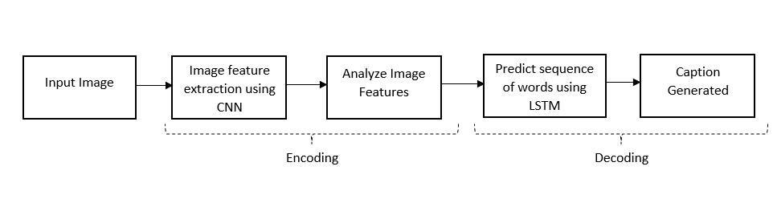
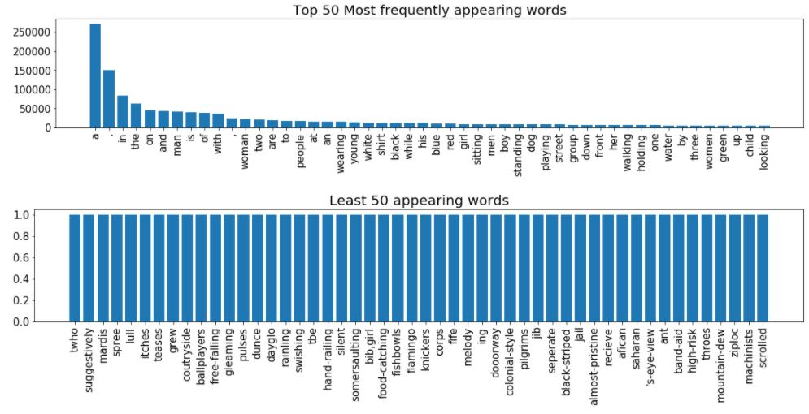
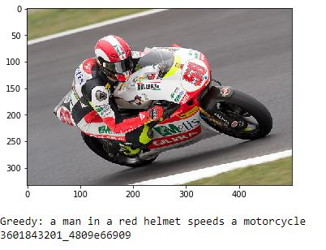
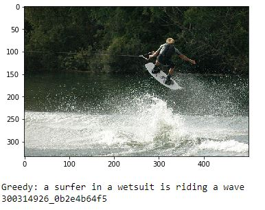
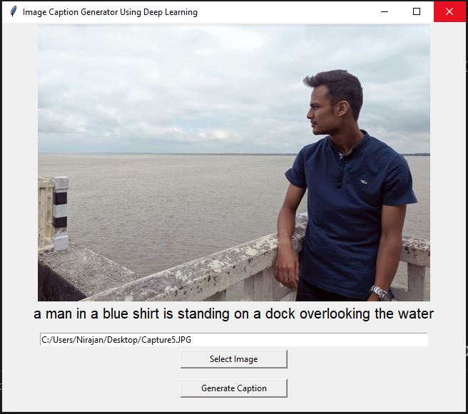

# IMAGE CAPTION GENERATOR USING DEEP LEARNING

## Objectives
* To recognize the context of an image and describe them in English.

## Block Diagram


## Basic phases for caption generation

### Data Collection from Dataset
* For the image caption generator, Flickr30K dataset is used. There are also other datasets like Flickr8k and MSCOCO dataset. The Flickr30k dataset contains about 30000 images each with 5 captions.

### Reading the data
* I created a dictionary which contains the name of the image without its extension type as a key and a list of the 5 captions for the corresponding images as values. In our datasets, there consists of large number of words where the top 50 most occurring and least occurring word are shown as follows:


### Data Cleaning
* Lowercasting all the characters and converting all the non-alphabetic characters (such as ‘#’, ‘%’, ‘$’, ‘&’, ‘@’ etc.), removing them and saving to a new file named ‘‘tokens_clean.txt’’. 
```python
def clean (data):
    # Convert all characters to lower case
    data = data.lower()

    # Convert all non-alphabet characters to ' '
    data = re.sub("[^a-z]+", " ", data)

    return data
	
print(clean("A man in green holds a guitar while the other man observes his shirt ."))

output: a man in green holds a guitar while the other man observes his shirt
```

### Loading the training and testing set
* When we load the data, we will add two tokens in every caption as:
i. ‘startseq’: This is a start sequence token which will be added at the start of every
caption.
ii. ‘endseq’: This is an end sequence token which will be added at the end of every
caption.

### Image Pre-processing
* The images from the Flickr_8k dataset were first transformed into an array before feeding it into the ResNet 50 model. The features of the images are extracted just before the last layer of classification. The output is an array vector of length 2048 which represents the features extracted from the images. A dictionary with each image tagged to its features is formed and saved. 

### Text Pre-processing
* We need to encode each word into a fixed sized vector. We created two python dictionaries namely “word_to_index” and “index_to_word”.
*These two python dictionaries can be used as follows:
- word_to_index[‘w’]: - returns index of the word ‘w’
- index_to_word[‘yhat’]: - returns the word whose index is ‘yhat’

### Data Preparation using Generator Function
* For the generation of the description of the input images, it undergoes the process of Long Short Term Memory (LSTM)

### Inference
* The output of the model is softmax function that generates probability distribution across all the words.
* Greedy Search Algorithm was used to select the words with maximum probability.
* BLEU Score was used as evaluation metrics.

## RESULTS
* Generated captions on test images:
- 
- 

#### UI was created using Tkinter.
Screenshot:
- 

#### Summary
1. Image sent to CNN(Resnet50).
2. Last layer of CNN is removed.
3. CNN produces image vector of length 2048.
4. Image vector and Caption sent to model.
5. Model generates probability distribution.
6. Select word with maximum probability.

## Implementation
- run ```text_data_processing.ipynb``` to create dictionary.
- run ```model_build.ipynb``` to create, train the model and evaluate the model.
- run ```ui.py``` to test the model on custom image.

* Place your dataset images into ```data/Images/```
* Place your dataset captions into ```data/textFiles/```
* After training your model, place them into ```model_checkpoints/```

## Requirements
1. Tensorflow
2. Anaconda
3. Python 3.7
4. Tkinter
5. Numpy

#### Training time: ~21 hrs on i7 8750H
